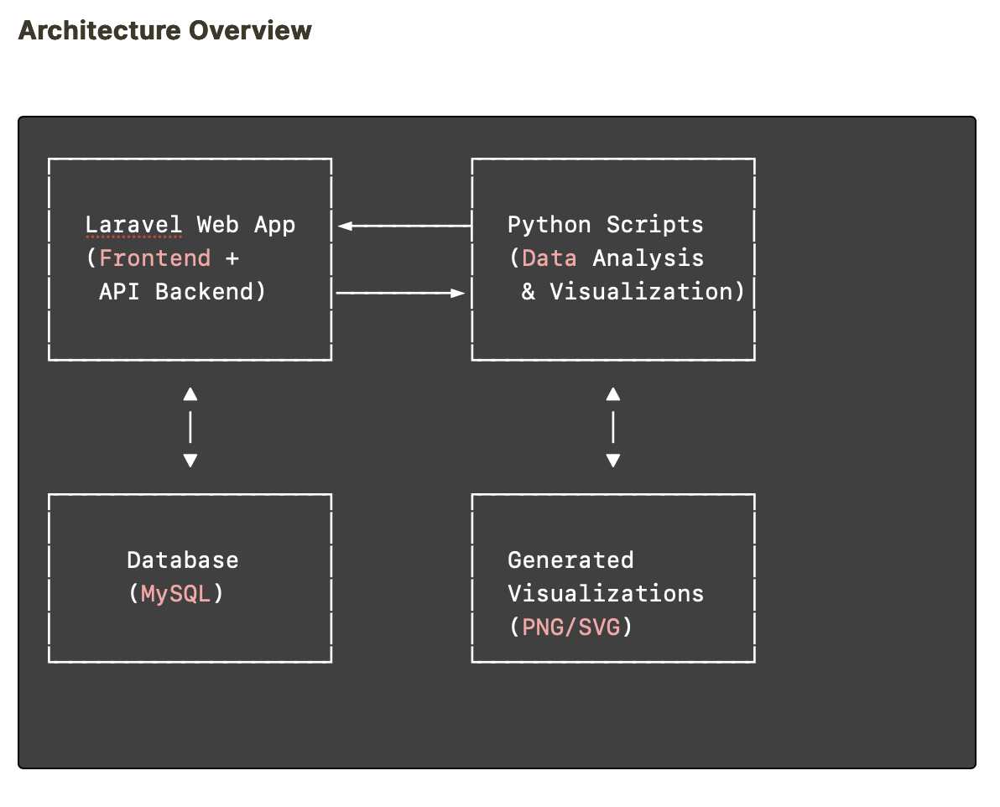

# DataVizEngine


## 🚀 Bridging Worlds: Web Application Meets Data Science

**DataVizEngine** is a groundbreaking integration platform that seamlessly connects Laravel's robust web framework capabilities with Python's scientific computing ecosystem. This project represents a paradigm shift in how web applications can harness the power of advanced data visualization without compromising on performance or developer experience.

<p align="center">
  
</p>

### 🌟 Key Innovations

- **Cross-Language Synergy**: Bridged the gap between PHP and Python ecosystems
- **Real-Time Processing**: Asynchronous processing of data visualization requests
- **Dynamic Rendering**: On-demand generation of publication-quality visualizations
- **Developer-Centric Design**: Intuitive APIs that abstract away complexity

## 🔧 Technology Stack

The project leverages cutting-edge technologies to deliver a seamless experience:

- **Frontend**: Laravel Blade + Alpine.js + Tailwind CSS
- **Backend**: Laravel 10+ Framework
- **Data Processing**: Python 3.9+ with NumPy and Pandas
- **Visualization**: Seaborn with Matplotlib
- **Integration**: Custom PHP-Python bridge with process management
- **Storage**: MySQL + filesystem-based visualization cache

## 📊 Visualization Capabilities

DataVizEngine supports a wide range of visualization types through Seaborn:

- Statistical plots (boxplots, violinplots)
- Distribution plots (histograms, KDEs)
- Relational plots (scatterplots, lineplots)
- Categorical plots (barplots, countplots)
- Matrix plots (heatmaps, clustermap)
- Regression plots (regplot, residplot)

## 💻 Quick Start

### Prerequisites

- PHP 8.1+
- Composer
- Python 3.9+
- Node.js and NPM

### Installation

```bash
# Clone the repository
git clone -b main https://github.com/dieterlab969/DataVizEngine.git
cd DataVizEngine

# Install PHP dependencies
composer install

# Install Node.js dependencies
npm install

# Set up environment
cp .env.example .env
php artisan key:generate

# Configure your database in .env
# ...

# Run migrations
php artisan migrate

# Set up Python environment
python -m venv venv
source venv/bin/activate  # On Windows: venv\Scripts\activate
pip install -r requirements.txt

# Build assets
npm run build

# Start the development server
php artisan serve
```

## 🔍 Usage Examples

### Creating a Basic Visualization

```php
// In your controller
public function generateVisualization(Request $request)
{
    $data = $request->validate([
        'dataset' => 'required|array',
        'type' => 'required|in:bar,scatter,line,heatmap,box',
        'x_column' => 'required|string',
        'y_column' => 'required|string',
        'title' => 'nullable|string',
    ]);
    
    $vizService = new VisualizationService();
    $result = $vizService->generateVisualization($data);
    
    return response()->json([
        'success' => true,
        'visualization_url' => asset('visualizations/' . $result['file']),
        'metadata' => $result['metadata'] ?? null,
    ]);
}
```

### Python Visualization Component

```python
def create_visualization(data, type, x_column, y_column, title=None):
    """
    Create a visualization based on provided parameters
    """
    df = pd.DataFrame(data['dataset'])
    
    plt.figure(figsize=(10, 6))
    sns.set_theme(style="whitegrid")
    
    if type == 'bar':
        ax = sns.barplot(x=x_column, y=y_column, data=df)
    elif type == 'scatter':
        ax = sns.scatterplot(x=x_column, y=y_column, data=df)
    # Additional plot types...
    
    if title:
        plt.title(title)
        
    filename = f"viz_{uuid.uuid4()}.png"
    filepath = os.path.join(OUTPUT_DIR, filename)
    plt.savefig(filepath, bbox_inches='tight', dpi=300)
    
    return {
        "status": "success",
        "file": filename,
        "metadata": {
            "dimensions": plt.gcf().get_size_inches(),
            "data_points": len(df),
            "columns_used": [x_column, y_column]
        }
    }
```

## 🛠️ Advanced Features

### 1. Intelligent Caching System

DataVizEngine implements a smart caching system that:
- Stores generated visualizations with their parameters
- Automatically regenerates when underlying data changes
- Efficiently serves cached visualizations for identical parameters

```php
// Example of the cache-aware visualization service
public function getOrGenerateVisualization(array $params)
{
    $cacheKey = $this->generateCacheKey($params);
    
    if ($this->visualizationCache->has($cacheKey)) {
        return $this->visualizationCache->get($cacheKey);
    }
    
    $result = $this->generateVisualization($params);
    $this->visualizationCache->put($cacheKey, $result, now()->addDays(7));
    
    return $result;
}
```

### 2. Asynchronous Processing

For complex visualizations, DataVizEngine leverages Laravel's queue system:

```php
// Dispatch a job to generate visualization asynchronously
VisualizationJob::dispatch($data)
    ->onQueue('visualizations');
```

### 3. Interactive Visualizations

Beyond static images, DataVizEngine can generate interactive visualizations using Plotly:

```python
def create_interactive_visualization(data, type):
    """Generate an interactive visualization using Plotly"""
    df = pd.DataFrame(data['dataset'])
    
    if type == 'scatter':
        fig = px.scatter(df, x=data['x_column'], y=data['y_column'])
    # Additional plot types...
    
    html_file = f"interactive_{uuid.uuid4()}.html"
    filepath = os.path.join(OUTPUT_DIR, html_file)
    fig.write_html(filepath)
    
    return {
        "status": "success",
        "file": html_file,
        "type": "interactive"
    }
```

## 🌈 Future Roadmap

The DataVizEngine is designed with extensibility in mind:

- **Machine Learning Integration**: Predictive analytics and model visualization
- **Real-time Data Processing**: WebSocket-based live updating visualizations
- **Data Source Connectors**: Integration with various data sources (APIs, databases)
- **Customizable Themes**: Advanced styling options for visualizations
- **Export Capabilities**: PDF reports and presentation-ready exports

## 📚 Documentation

For comprehensive documentation, please visit:
- [Installation Guide](docs/installation.md)
- [API Reference](docs/api.md)
- [Visualization Types](docs/visualizations.md)
- [Advanced Configuration](docs/configuration.md)
- [Examples & Tutorials](docs/examples.md)

## 🔄 Development Workflow

```
1. Define data structure ➡️ 2. Configure visualization ➡️ 3. Process in Python
       ⬆️                                                           ⬇️
6. Analyze & iterate ⬅️ 5. Display in Laravel app ⬅️ 4. Return results
```

## 🤝 Contributing

Contributions are welcome! Please feel free to submit a Pull Request.

## 📝 License

This project is licensed under the MIT License - see the [LICENSE](LICENSE) file for details.

---

<p align="center">Built with ❤️ by [Dieter R.]</p>
<p align="center">© 2025 DataVizEngine</p>
